# 💫 About Me

Hi, I am Muhammad Fawad.

I am a researcher working in health data science, combining statistical modeling, machine learning, and epidemiology to better understand and address real-world health challenges.

## 🔬 Research Interests

- Disease prediction and early detection
- Medication use and cancer risk
- Cardiometabolic and infectious disease epidemiology
- Large-scale biomedical data analysis

## 🌐 Links

## 💻 Programming Languages & Research Tools

<a href="https://www.python.org/">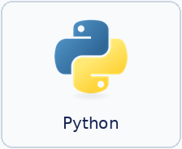</a>
<a href="https://numpy.org/">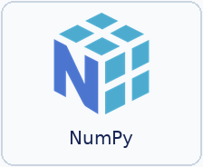</a>

<a href="https://scipy.org/">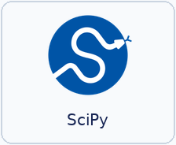</a>
<a href="https://www.statsmodels.org/stable/">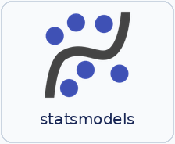</a>
<a href="https://scikit-learn.org/stable/">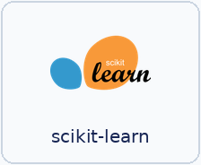</a>
<a href="https://lifelines.readthedocs.io/en/latest/">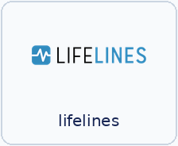</a>
<a href="https://scikit-survival.readthedocs.io/">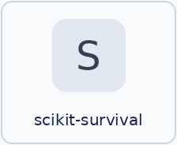</a>
<a href="https://lmoments3.readthedocs.io/">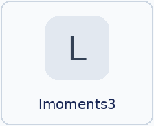</a>
<a href="https://matplotlib.org/">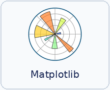</a>
<a href="https://plotly.com/python/">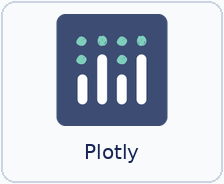</a>

<a href="https://www.r-project.org/">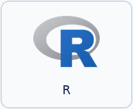</a>
<a href="https://cran.r-project.org/package=stats">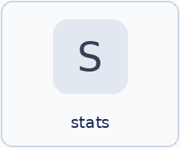</a>
<a href="https://cran.r-project.org/package=caret">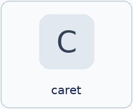</a>
<a href="https://cran.r-project.org/package=survival">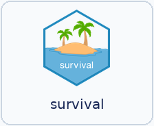</a>
<a href="https://cran.r-project.org/package=survminer">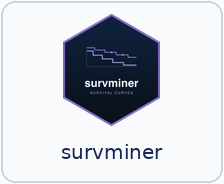</a>
<a href="https://cran.r-project.org/package=lmom">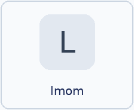</a>
<a href="https://cran.r-project.org/package=lmomco">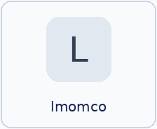</a>
<a href="https://cran.r-project.org/package=lmomRFA">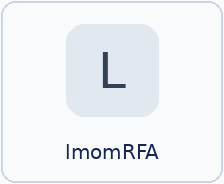</a>
<a href="https://cran.r-project.org/package=Lmoments">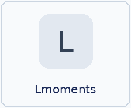</a>
<a href="https://cran.r-project.org/package=TLMoments">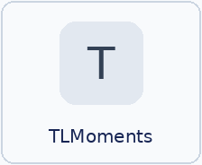</a>
<a href="https://dplyr.tidyverse.org/">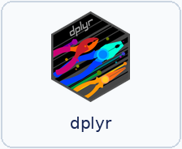</a>
<a href="https://tidyr.tidyverse.org/">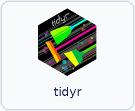</a>
<a href="https://ggplot2.tidyverse.org/">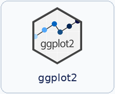</a>
<a href="https://patchwork.data-imaginist.com/">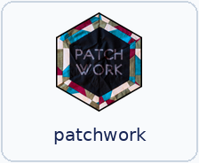</a>
<a href="https://ggrepel.slowkow.com/">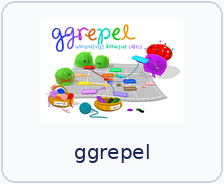</a>
<a href="https://www.indrapatil.com/ggstatsplot/">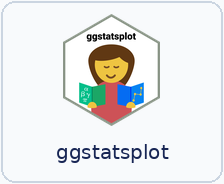</a>

<a href="https://www.ibm.com/products/spss-statistics">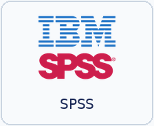</a>
<a href="https://www.sas.com/">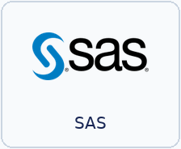</a>
<a href="https://www.latex-project.org/">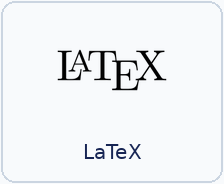</a>
<a href="https://www.anaconda.com/">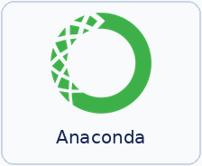</a>
<a href="https://developer.nvidia.com/cuda-toolkit">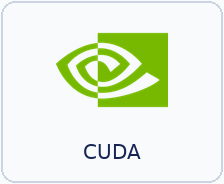</a>

<a href="https://research.csc.fi/service/sd-desktop/">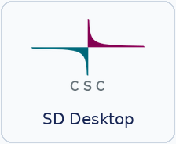</a>
<a href="https://www.istekki.fi/6998-2/">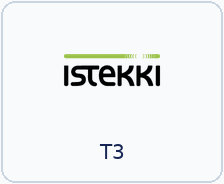</a>

## 📊 GitHub Stats

---

<!-- Created with GPRM (https://gprm.itsvg.in/) -->
